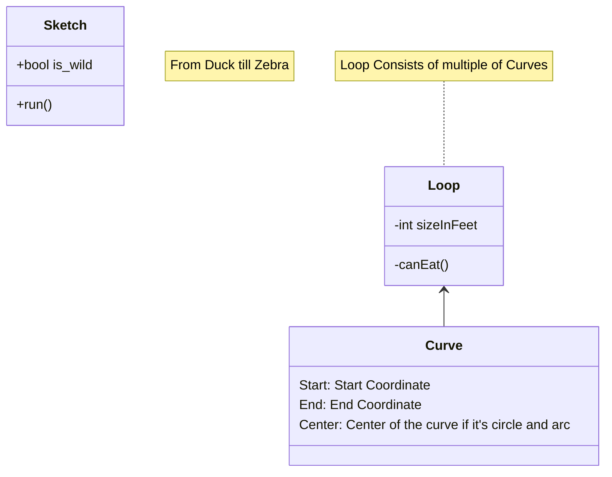

# CC3DParser

The repository contains code for constructing vector from Json files in CC3D Parser. These vecotrs are in the format of DeepCAD input.

## Environment

```bash
$ conda env create --file=cc3dparser.yml
$ conda activate cc3dparser
```

## Data

Dataset is saved in `Sapphire` server in the following directory.

- `Json Files`: `/data/3d_cluster/CC3D-OP-SEQ/cc3d_v3.0_recs_extrude`.
- `BRep`: `/data/3d_cluster/CC3D-OP-SEQ/cc3d_v3.0_pid_steps_extrude`.

## Create Vectors from Json (Json --> H5)
Check if the `JSON_PATH` and `OUTPUT_PATH` are in correct format.

```bash
$ ./cc3dparser.sh
```

## Reconstruct Brep

- From `Json` files (Default)

```bash
./modelVisualizer.sh
```


- From `H5` Files

First create the vectors and store it in `OUTPUT_PATH` folder.
```bash
$ ./cc3dparser.sh
```
After that, change the `INPUT_DIR` in `modelVisualizer.sh` to the `OUTPUT_PATH` value and change the `FORM` to `json`.

```bash
./modelVisualizer.sh
```

## About Json
The keys in the json are described as below.


